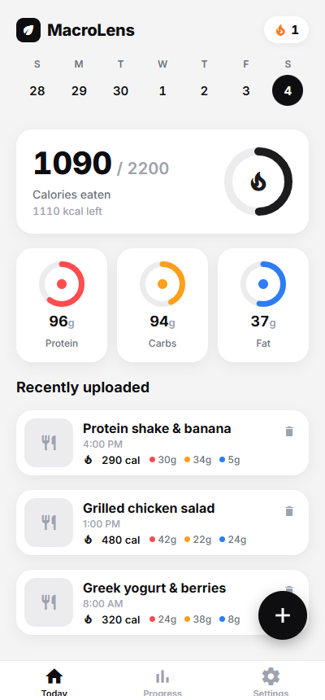
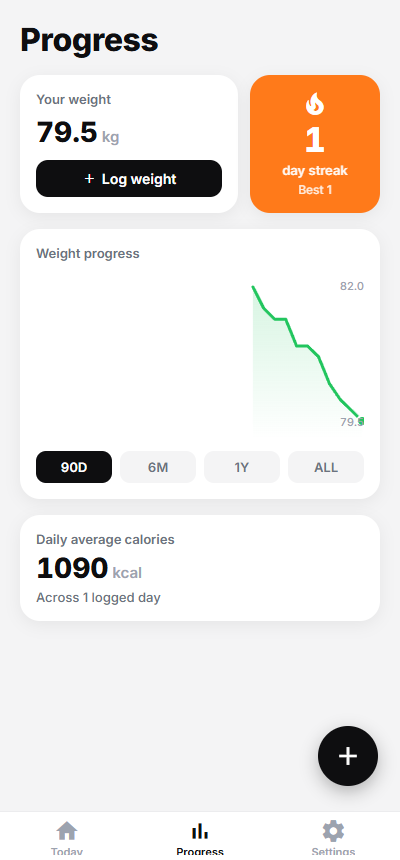
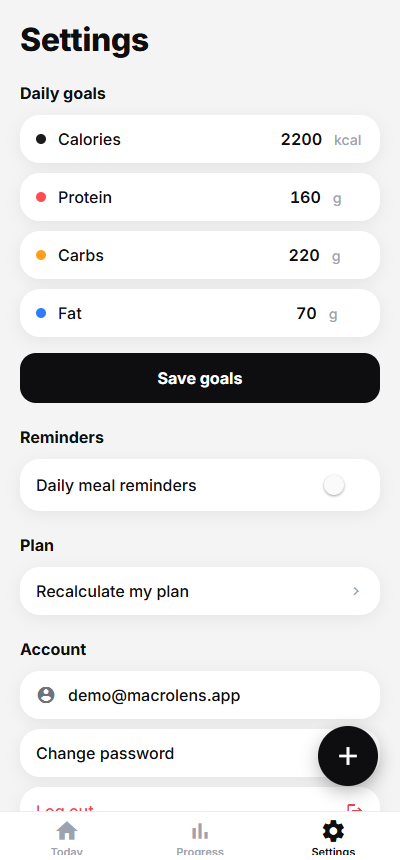
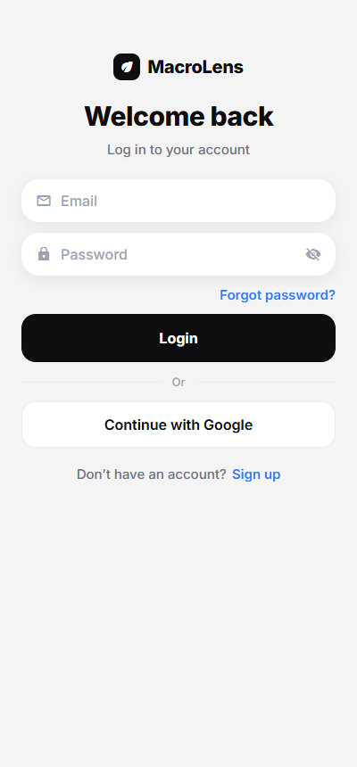
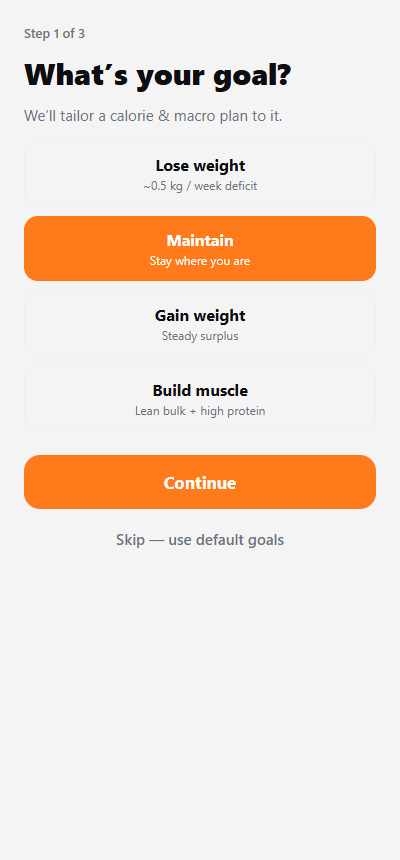

# MacroLens 📸🍽️

**Snap a photo of your meal, get an instant calorie & macro estimate, and track your day.**
A production-grade mobile calorie tracker built with Expo (SDK 54) and Supabase — cloud-synced, offline-capable, and RLS-secured per user.

> Built end-to-end in collaboration with **Claude Code**. See [`CLAUDE.md`](CLAUDE.md) for the full architecture write-up.

---

## Screenshots

| Today | Progress | Settings |
|:---:|:---:|:---:|
|  |  |  |

| Sign in | Onboarding |
|:---:|:---:|
|  |  |

---

## Features

- **AI photo → nutrition** — point the camera at a meal; an Anthropic-backed vision model returns calories, protein, carbs, and fat, which you can review and edit before logging.
- **Calorie & macro rings** — a Cal AI-style dashboard with animated progress rings for the day's goals.
- **Streaks** — a logging streak recomputed from your history (pure, unit-tested logic).
- **Body-weight progress** — log your weight and watch the trend on a 90D / 6M / 1Y / ALL line chart.
- **Personalized plan** — onboarding computes recommended calories & macros via Mifflin-St Jeor BMR, FAO/WHO activity multipliers, ISSN protein, and IOM AMDR ranges.
- **Cloud sync + offline** — everything persists to Supabase and is cached with TanStack Query, so screens render instantly (even offline) and revalidate in the background.
- **Full auth** — email/password and Google OAuth, password reset via in-app OTP, and self-service account deletion (server-side cascade).

## Tech stack

- **App** — [Expo SDK 54](https://docs.expo.dev/versions/v54.0.0/), Expo Router (file-based routing), React Native, TypeScript (strict), React Compiler.
- **State/data** — [TanStack Query](https://tanstack.com/query) with AsyncStorage persistence.
- **Backend** — [Supabase](https://supabase.com): Postgres + Row-Level Security, Auth, Storage (private meal-photo bucket), and Edge Functions.
- **AI** — Anthropic Claude, called through a Supabase **Edge Function proxy** so the API key never ships in the client bundle.
- **UI** — Reanimated, SVG progress rings, a light-only Cal AI-inspired design system.

## Architecture at a glance

Camera → AI nutrition estimate → review/edit → log. All CRUD flows through a single data boundary (`lib/entries.ts`) backed by Supabase with per-user RLS; screens never touch `supabase.from(...)` directly. The session lives in encrypted secure storage; reads are cached and revalidated on focus.

The full architecture — provider stack, the three-state auth/onboarding gate, the data layer, and the database schema/migrations — is documented in [`CLAUDE.md`](CLAUDE.md).

## Getting started

```bash
git clone <this-repo>
cd macrolens
npm install

cp .env.example .env   # fill in your Supabase URL + anon key
npm start              # press i / a / w for iOS / Android / web
```

### Environment

`.env` (see [`.env.example`](.env.example)) needs the public Supabase values, read at bundle time:

- `EXPO_PUBLIC_SUPABASE_URL`
- `EXPO_PUBLIC_SUPABASE_ANON_KEY` — the anon key is public by design (protected by RLS).

> **The Anthropic key is never a client env var.** The AI call is proxied by the `analyze-meal` Edge Function, which holds `ANTHROPIC_API_KEY` as a **server-side Supabase secret** (`supabase secrets set ANTHROPIC_API_KEY=…`).

### Supabase (local)

```bash
supabase start        # boot the local stack (Docker)
supabase db reset     # apply migrations from scratch
```

### Tests

Two pure-logic specs run directly under `tsx` (no framework):

```bash
npx tsx lib/streak.test.ts          # streak rules
npx tsx lib/nutrition-plan.test.ts  # calorie/macro plan math
```

## License

[MIT](LICENSE) © 2026 Roi Izchak
